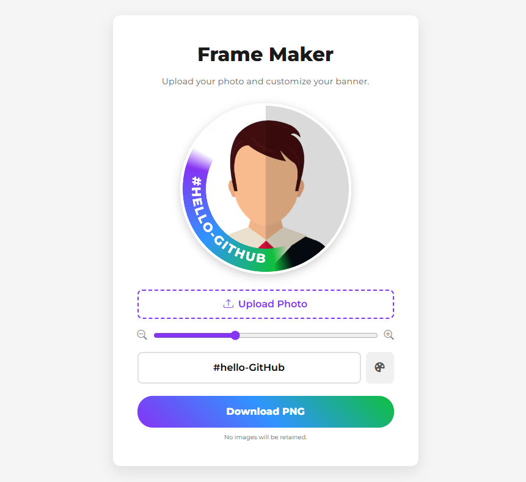

# LinkedIn Frame Maker



A web app to upload a profile picture and customize it with a frame/banner for LinkedIn.

## Setup

1. Install dependencies for linting and formatting:
   ```bash
   npm install
   ```

2. Start a local server:
   ```bash
   npx serve
   # or
   python -m http.server
   ```

## Development

- `npm run format`: Formats code with Prettier.
- `npm run lint`: Lints JavaScript files using ESLint.

### Tailwind build workflow

#### Development (watch + auto-rebuild)

```bash
npm run start:tailwind
```

- Watches `css/tailwind.css` and recompiles to `css/tailwind-build.css`.
- Use while editing UI styles.

#### Production build

```bash
npm run build:tailwind
```

- Compiles `css/tailwind.css` to `css/tailwind-build.css` with minification.
